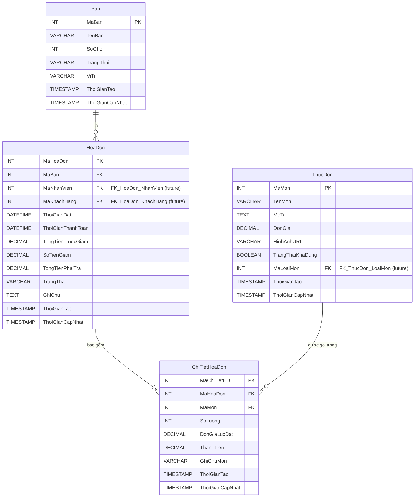

## Thiết Kế Cơ Sở Dữ Liệu Quản Lý Quán Cafe

### Các Bảng Chính:

1.  **`Ban` (Tables)**: Quản lý thông tin các bàn trong quán.
2.  **`ThucDon` (MenuItems)**: Quản lý danh sách các món ăn, thức uống.
3.  **`HoaDon` (Orders)**: Quản lý thông tin các hóa đơn.
4.  **`ChiTietHoaDon` (OrderDetails)**: Quản lý chi tiết các món trong từng hóa đơn.

---

### 1. Bảng `Ban` (Tables)

- **Mục đích**: Lưu trữ thông tin về các bàn trong quán, bao gồm trạng thái và sức chứa.
- **Các cột**:

  | Tên cột           | Kiểu dữ liệu   | Ràng buộc                                               | Mô tả                                             |
  | :---------------- | :------------- | :------------------------------------------------------ | :------------------------------------------------ |
  | `MaBan`           | `INT`          | `PRIMARY KEY`, `AUTO_INCREMENT`                         | Mã định danh duy nhất cho mỗi bàn.                |
  | `TenBan`          | `VARCHAR(50)`  | `NOT NULL`, `UNIQUE`                                    | Tên/số hiệu của bàn (ví dụ: "Bàn 1", "VIP A").    |
  | `SoGhe`           | `INT`          | `NULL`, `CHECK (SoGhe > 0)`                             | Số lượng ghế tối đa của bàn.                      |
  | `TrangThai`       | `VARCHAR(20)`  | `NOT NULL`, `DEFAULT 'Trống'`                           | Trạng thái bàn: 'Trống', 'Có khách', 'Đã đặt'.    |
  | `ViTri`           | `VARCHAR(100)` | `NULL`                                                  | Mô tả vị trí bàn (ví dụ: "Tầng 1", "Gần cửa sổ"). |
  | `ThoiGianTao`     | `TIMESTAMP`    | `DEFAULT CURRENT_TIMESTAMP`                             | Thời gian tạo bản ghi.                            |
  | `ThoiGianCapNhat` | `TIMESTAMP`    | `DEFAULT CURRENT_TIMESTAMP ON UPDATE CURRENT_TIMESTAMP` | Thời gian cập nhật bản ghi gần nhất.              |

- **Khóa chính**: `MaBan`
- **Khóa ngoại**: Không có trong bảng này.

---

### 2. Bảng `ThucDon` (MenuItems)

- **Mục đích**: Lưu trữ thông tin chi tiết về các món ăn, thức uống của quán.
- **Các cột**:

  | Tên cột            | Kiểu dữ liệu    | Ràng buộc                                               | Mô tả                                                   |
  | :----------------- | :-------------- | :------------------------------------------------------ | :------------------------------------------------------ |
  | `MaMon`            | `INT`           | `PRIMARY KEY`, `AUTO_INCREMENT`                         | Mã định danh duy nhất cho mỗi món.                      |
  | `TenMon`           | `VARCHAR(255)`  | `NOT NULL`, `UNIQUE`                                    | Tên món ăn/thức uống.                                   |
  | `MoTa`             | `TEXT`          | `NULL`                                                  | Mô tả chi tiết về món.                                  |
  | `DonGia`           | `DECIMAL(10,0)` | `NOT NULL`, `CHECK (DonGia >= 0)`                       | Đơn giá của món (sử dụng DECIMAL cho tiền tệ Việt Nam). |
  | `HinhAnhURL`       | `VARCHAR(255)`  | `NULL`                                                  | Đường dẫn đến hình ảnh minh họa món.                    |
  | `TrangThaiKhaDung` | `BOOLEAN`       | `NOT NULL`, `DEFAULT TRUE`                              | Trạng thái còn hàng/phục vụ (TRUE/FALSE).               |
  | `MaLoaiMon`        | `INT`           | `NULL`                                                  | Khóa ngoại tham chiếu đến bảng `LoaiMon` (mở rộng).     |
  | `ThoiGianTao`      | `TIMESTAMP`     | `DEFAULT CURRENT_TIMESTAMP`                             | Thời gian tạo bản ghi.                                  |
  | `ThoiGianCapNhat`  | `TIMESTAMP`     | `DEFAULT CURRENT_TIMESTAMP ON UPDATE CURRENT_TIMESTAMP` | Thời gian cập nhật bản ghi gần nhất.                    |

- **Khóa chính**: `MaMon`
- **Khóa ngoại**:
  - `MaLoaiMon` (tham chiếu đến bảng `LoaiMon(MaLoaiMon)` - sẽ được tạo khi mở rộng).

---

### 3. Bảng `HoaDon` (Orders)

- **Mục đích**: Lưu trữ thông tin về mỗi lượt gọi món của khách hàng.
- **Các cột**:

  | Tên cột             | Kiểu dữ liệu    | Ràng buộc                                               | Mô tả                                                                          |
  | :------------------ | :-------------- | :------------------------------------------------------ | :----------------------------------------------------------------------------- |
  | `MaHoaDon`          | `INT`           | `PRIMARY KEY`, `AUTO_INCREMENT`                         | Mã định danh duy nhất cho mỗi hóa đơn.                                         |
  | `MaBan`             | `INT`           | `NOT NULL`                                              | Khóa ngoại tham chiếu đến bàn đã đặt.                                          |
  | `MaNhanVien`        | `INT`           | `NULL`                                                  | Khóa ngoại tham chiếu đến nhân viên phục vụ (mở rộng).                         |
  | `MaKhachHang`       | `INT`           | `NULL`                                                  | Khóa ngoại tham chiếu đến khách hàng (mở rộng).                                |
  | `ThoiGianDat`       | `DATETIME`      | `NOT NULL`, `DEFAULT CURRENT_TIMESTAMP`                 | Thời gian khách hàng bắt đầu gọi món.                                          |
  | `ThoiGianThanhToan` | `DATETIME`      | `NULL`                                                  | Thời gian hóa đơn được thanh toán.                                             |
  | `TongTienTruocGiam` | `DECIMAL(12,0)` | `NOT NULL`, `DEFAULT 0`                                 | Tổng tiền các món trong hóa đơn trước khi giảm giá.                            |
  | `SoTienGiam`        | `DECIMAL(12,0)` | `NOT NULL`, `DEFAULT 0`                                 | Số tiền được giảm giá (nếu có).                                                |
  | `TongTienPhaiTra`   | `DECIMAL(12,0)` | `NOT NULL`, `DEFAULT 0`                                 | Tổng tiền khách phải trả (TongTienTruocGiam - SoTienGiam).                     |
  | `TrangThai`         | `VARCHAR(30)`   | `NOT NULL`, `DEFAULT 'Đang xử lý'`                      | Trạng thái hóa đơn: 'Đang xử lý', 'Chờ thanh toán', 'Đã thanh toán', 'Đã hủy'. |
  | `GhiChu`            | `TEXT`          | `NULL`                                                  | Ghi chú chung cho hóa đơn.                                                     |
  | `ThoiGianTao`       | `TIMESTAMP`     | `DEFAULT CURRENT_TIMESTAMP`                             | Thời gian tạo bản ghi.                                                         |
  | `ThoiGianCapNhat`   | `TIMESTAMP`     | `DEFAULT CURRENT_TIMESTAMP ON UPDATE CURRENT_TIMESTAMP` | Thời gian cập nhật bản ghi gần nhất.                                           |

- **Khóa chính**: `MaHoaDon`
- **Khóa ngoại**:
  - `MaBan` tham chiếu đến `Ban(MaBan)`.
  - `MaNhanVien` (tham chiếu đến bảng `NhanVien(MaNhanVien)` - sẽ được tạo khi mở rộng).
  - `MaKhachHang` (tham chiếu đến bảng `KhachHang(MaKhachHang)` - sẽ được tạo khi mở rộng).
- **Lưu ý**: `TongTienTruocGiam` và `TongTienPhaiTra` có thể được tính toán động từ `ChiTietHoaDon` hoặc lưu trữ để tối ưu truy vấn. Nếu lưu trữ, cần đảm bảo tính nhất quán dữ liệu (ví dụ: dùng trigger).

---

### 4. Bảng `ChiTietHoaDon` (OrderDetails)

- **Mục đích**: Lưu trữ chi tiết các món được gọi trong một hóa đơn cụ thể, bao gồm số lượng và giá tại thời điểm gọi.
- **Các cột**:

  | Tên cột           | Kiểu dữ liệu    | Ràng buộc                                               | Mô tả                                                                       |
  | :---------------- | :-------------- | :------------------------------------------------------ | :-------------------------------------------------------------------------- |
  | `MaChiTietHD`     | `INT`           | `PRIMARY KEY`, `AUTO_INCREMENT`                         | Mã định danh duy nhất cho chi tiết hóa đơn.                                 |
  | `MaHoaDon`        | `INT`           | `NOT NULL`                                              | Khóa ngoại tham chiếu đến hóa đơn.                                          |
  | `MaMon`           | `INT`           | `NOT NULL`                                              | Khóa ngoại tham chiếu đến món trong thực đơn.                               |
  | `SoLuong`         | `INT`           | `NOT NULL`, `CHECK (SoLuong > 0)`                       | Số lượng món được gọi.                                                      |
  | `DonGiaLucDat`    | `DECIMAL(10,0)` | `NOT NULL`                                              | Đơn giá của món tại thời điểm đặt hàng (quan trọng vì giá có thể thay đổi). |
  | `ThanhTien`       | `DECIMAL(12,0)` | `NOT NULL`                                              | Thành tiền của món này (SoLuong \* DonGiaLucDat).                           |
  | `GhiChuMon`       | `VARCHAR(255)`  | `NULL`                                                  | Ghi chú riêng cho món này (ví dụ: "ít đường", "không đá").                  |
  | `ThoiGianTao`     | `TIMESTAMP`     | `DEFAULT CURRENT_TIMESTAMP`                             | Thời gian tạo bản ghi.                                                      |
  | `ThoiGianCapNhat` | `TIMESTAMP`     | `DEFAULT CURRENT_TIMESTAMP ON UPDATE CURRENT_TIMESTAMP` | Thời gian cập nhật bản ghi gần nhất.                                        |

- **Khóa chính**: `MaChiTietHD`
- **Khóa ngoại**:
  - `MaHoaDon` tham chiếu đến `HoaDon(MaHoaDon)`.
  - `MaMon` tham chiếu đến `ThucDon(MaMon)`.
- **Ràng buộc bổ sung**: Có thể thêm ràng buộc `UNIQUE (MaHoaDon, MaMon)` nếu muốn mỗi món chỉ xuất hiện một lần trong một hóa đơn (nếu gọi thêm thì tăng số lượng). Tuy nhiên, thường thì cho phép gọi cùng một món nhiều lần với các ghi chú khác nhau (ví dụ: 1 cafe đen, 1 cafe đen ít đường).
- **Lưu ý**: `ThanhTien` có thể được tính toán động.

---

### Mối Quan Hệ Giữa Các Bảng

- Một `Ban` có thể có nhiều `HoaDon` (theo thời gian, nhưng thường chỉ một hóa đơn `Đang xử lý` hoặc `Chờ thanh toán` tại một thời điểm).
- Một `HoaDon` phải thuộc về một `Ban` duy nhất.
- Một `HoaDon` bao gồm nhiều `ChiTietHoaDon`.
- Một `ChiTietHoaDon` phải thuộc về một `HoaDon` duy nhất.
- Một `ChiTietHoaDon` phải tương ứng với một `Mon` trong `ThucDon`.
- Một `Mon` trong `ThucDon` có thể xuất hiện trong nhiều `ChiTietHoaDon` khác nhau.

---

### Khả Năng Mở Rộng

Thiết kế này dễ dàng mở rộng bằng cách thêm các bảng sau:

1.  **`NhanVien` (Employees)**:
    - `MaNhanVien` (PK), `TenNhanVien`, `ChucVu`, `TenDangNhap`, `MatKhauHash`, `MaQuyen` (FK), `SoDienThoai`, `TrangThaiHoatDong`...
    - Liên kết với `HoaDon(MaNhanVien)` để theo dõi nhân viên nào tạo/phục vụ hóa đơn.
2.  **`QuyenHan` (Roles/Permissions)**:
    - `MaQuyen` (PK), `TenQuyen`, `MoTaQuyen`...
    - Liên kết với `NhanVien(MaQuyen)` để phân quyền chức năng.
3.  **`KhachHang` (Customers)**:
    - `MaKhachHang` (PK), `TenKhachHang`, `SoDienThoai` (có thể dùng làm mã khách hàng thân thiết), `Email`, `DiemTichLuy`...
    - Liên kết với `HoaDon(MaKhachHang)` để theo dõi khách hàng và áp dụng chương trình khuyến mãi.
4.  **`LoaiMon` (Categories)**:
    - `MaLoaiMon` (PK), `TenLoaiMon` (ví dụ: "Cà phê", "Trà sữa", "Nước ép", "Bánh ngọt")...
    - Liên kết với `ThucDon(MaLoaiMon)` để phân loại món, dễ quản lý và tìm kiếm.
5.  **`KhuyenMai` (Promotions/Discounts)**:
    - `MaKhuyenMai` (PK), `TenChuongTrinh`, `MoTa`, `LoaiGiamGia` ('PhanTram', 'SoTienCoDinh'), `GiaTriGiam`, `NgayBatDau`, `NgayKetThuc`, `DieuKienApDung` (ví dụ: tổng hóa đơn tối thiểu, áp dụng cho món cụ thể)...
    - Có thể tạo bảng trung gian `HoaDon_KhuyenMai` để áp dụng nhiều khuyến mãi cho một hóa đơn, hoặc thêm cột `MaKhuyenMai` vào bảng `HoaDon` nếu chỉ áp dụng một khuyến mãi. Cập nhật `SoTienGiam` trong `HoaDon`.
6.  **`CaLamViec` (Shifts)**:
    - `MaCa` (PK), `TenCa`, `ThoiGianBatDau`, `ThoiGianKetThuc`...
    - Có thể liên kết với `HoaDon` hoặc bảng chấm công nhân viên.
7.  **`PhieuNhapKho` (StockInvoices) / `NguyenLieu` (Ingredients)**:
    - Để quản lý kho nguyên vật liệu, định lượng cho món ăn. Đây là một module lớn hơn.

---

Thiết kế này cung cấp một nền tảng vững chắc cho các hoạt động cơ bản của quán cafe và có thể dễ dàng được điều chỉnh, mở rộng để đáp ứng các yêu cầu phức tạp hơn trong tương lai.
